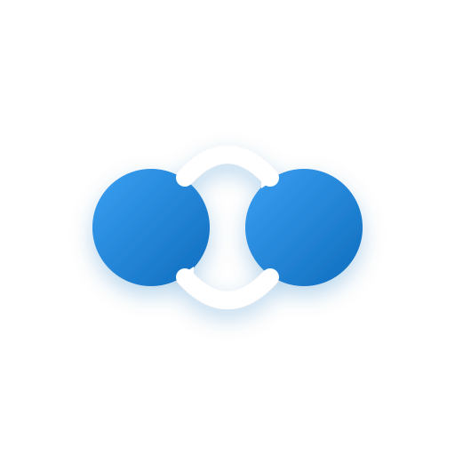
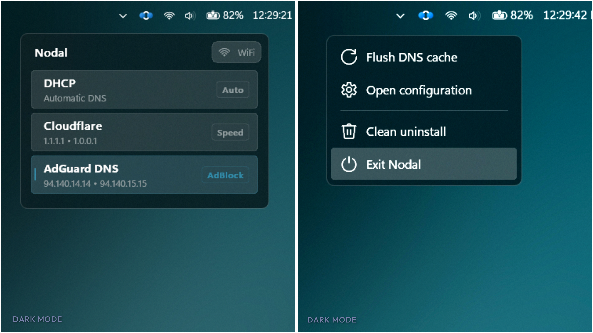
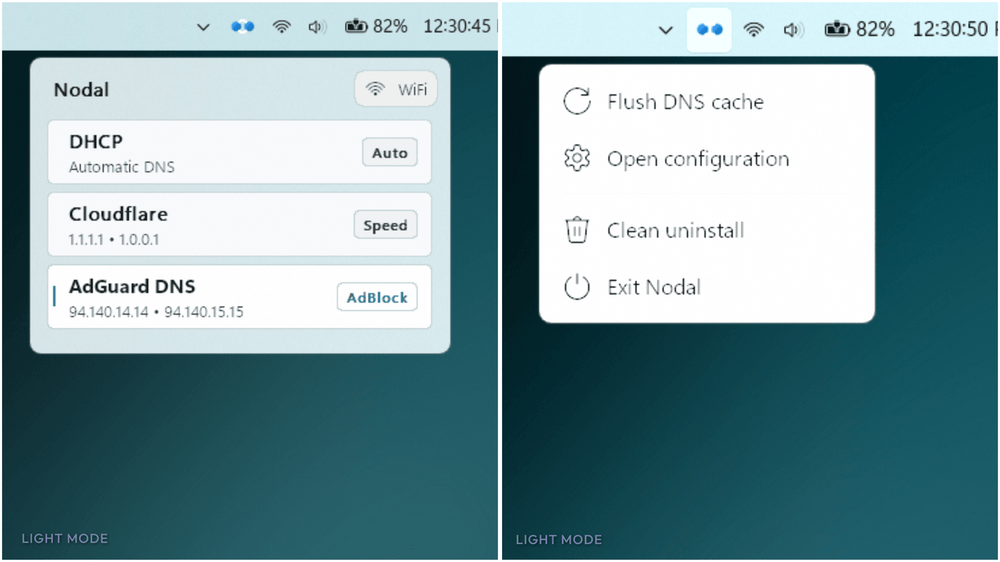

  

<h1 align="center" style="font-size:2.5rem;font-weight:800;margin:0.5rem 0 0.25rem;color:#1C2833;letter-spacing:-0.02em;">Nodal</h1>

  Your DNS, switched in one click — right from the tray. 
  Native Windows. No dashboard. No account. No telemetry. Free forever.

  
  
  
  
  

---

## Preview

  <picture>
    <source srcset="docs/images/preview-dark-flyout.webp" type="image/webp">
    
  </picture>

  <picture>
    <source srcset="docs/images/preview-light-flyout.webp" type="image/webp">
    
  </picture>

## Why Nodal

| | |
| --- | --- |
| **One click** | Switch resolvers straight from the tray; Windows Settings never opens. |
| **Native Win32** | Dark/light and accent aware. No Electron, no web views, no runtimes. |
| **Silent privilege** | Approve elevation once; every later switch runs without prompts. |
| **Zero footprint** | No drivers, no services, no telemetry, no network requests of its own. |
| **Clean uninstall** | One tray action reverses every change Nodal ever made. |
| **Featherweight** | One self-contained executable, under 5 MB idle. |

## Install

Download the installer from [Releases](https://github.com/uswuth/Nodal/releases) and run it —
a portable build ships alongside it. Every stage, checksum verification and unattended switch:
[Installation guide](docs/installation.md).

## Uninstall

Right-click the tray icon → **Clean uninstall**. Automatic DNS is restored on every adapter, the
scheduled task, startup entry, presets and the app itself are removed — nothing else on the PC is
touched. Details: [Uninstall](docs/installation.md#uninstall).

## Configuration

Presets, theme and privacy behaviour are driven by one local file — every key, type and constraint
documented: [Configuration](docs/configuration.md).

## Product identity

| | |
| --- | --- |
| **Publisher** | Nodal Open Source Project |
| **Price** | Free of charge — no subscription, no trial, no license key, no account |
| **License** | <a href="LICENSE">MIT</a> |
| **Platform** | Windows 10 / 11, 64-bit |

## Policies

Nodal contains no telemetry and makes no network requests of its own — all data stays on your
machine.

- [Privacy Policy](PRIVACY_POLICY.md) — what stays local, what is never collected, how to erase everything
- [Terms of Service & EULA](TERMS_AND_POLICY.md) — system rights, warranty disclaimer, third-party notices
- [DNS Directory](docs/dns-guide.md) — curated resolvers ready to paste into a custom profile

---

  Built with <a href="https://go.dev/">Go</a> · Distributed under the <a href="LICENSE">MIT License</a> ·
  <a href="https://github.com/uswuth/Nodal">Source on GitHub</a>

